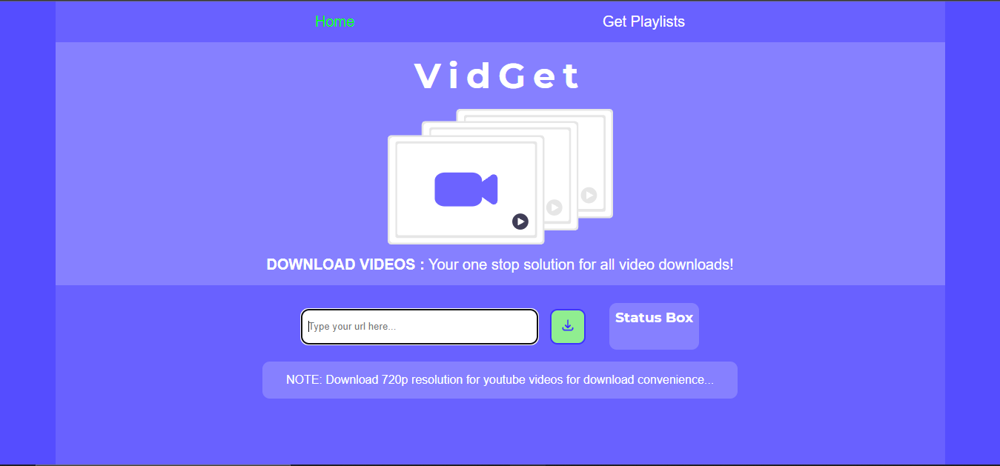
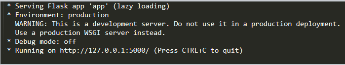

<!-- MAde by @GeorgeET15 -->
<!-- PROJECT LOGO -->
<br />
<p align="center">
  <a href="https://github.com/GeorgeET15/Video-Downloader-Website">
    
  </a>

  <h1 align="center">VidGet</h1>

  <p>
    <h2 align="center"> An awesome website for downloading YouTube videos !</h2>
</p>

<!-- ABOUT THE PROJECT -->
## About The Project

<p align="center">
  <a href="https://github.com/GeorgeET15/Video-Downloader-Website">
    
  </a>

VidGet is a great website that allowws you to download YouTube Videos very easily. It is a very simple to use and is very powerful and fast

### Built With

* Python
* CSS
* HTML


<!-- GETTING STARTED -->
## Getting Started

Follow these steps to quickly setup your VidGet website.
  
### Prerequisites

This is an example of how to list things you need to use the software and how to install them.
  
 * flask
  
  ```sh
  pip install flask
  ```
 * youtube_dl
  
  ```sh
  pip install youtube_dl
  ```  
<!-- USAGE EXAMPLES -->
## Usage

 - After installing the prequisites download the source code
  
  ```sh
  git clone https://github.com/Rasesh2005/Video-Downloader-Website.git
  ``` 
- Open the file and run the app.py file
  
  <a href="https://github.com/GeorgeET15/Video-Downloader-Website">
    
  </a>
  
- Now copy and paste the HTTP address in your browser
  
  - copy paste the video link.
  - choose the quality of the video and click download.
  - Now your can download all your favourite videos 
  
  <h> Happy Downloading ;) </h>  


<!-- CONTRIBUTING -->
## Contributing

Contributions are what make the open source community such an amazing place to learn, inspire, and create. Any contributions you make are **greatly appreciated**.

1. Fork the Project
2. Create your Feature Branch (`git checkout -b feature/AmazingFeature`)
3. Commit your Changes (`git commit -m 'Add some AmazingFeature'`)
4. Push to the Branch (`git push origin feature/AmazingFeature`)
5. Open a Pull Request

<!-- CONTACT -->
## Contact

Project Link: [CLICK HERE](https://github.com/Rasesh2005/Video-Downloader-Website)
